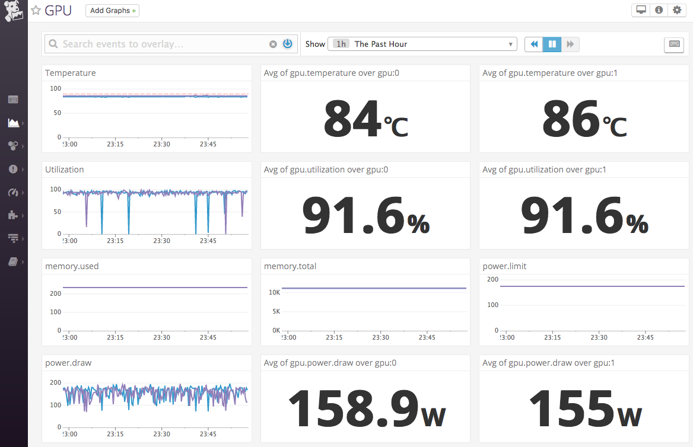

# datadog-gpustat

[Agent Check](https://docs.datadoghq.com/agent/agent_checks/)
to get metrics from [NVIDIA Management Library (NVML)](https://developer.nvidia.com/nvidia-management-library-nvml)



## Installation

```sh
make install
```

To test installation, run

```sh
make check
```

If you want to uninstall, just run

```sh
make uninstall
```

## Licence

The MIT License  
Copyright (c) 2018 Tsukasa OMOTO

## Acknowledgments

- [wookayin/gpustat](https://github.com/wookayin/gpustat)
  - [nvidia-ml-py](https://pypi.python.org/pypi/nvidia-ml-py/)
- [ngi644/datadog_nvml](https://github.com/ngi644/datadog_nvml)
